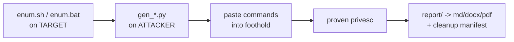

# fieldkit

The field kit for the hours between first contact and full compromise.

A deterministic, air-gap-friendly toolkit for **authorized** penetration testing and security assessments,
covering the whole funnel: **initial access → privilege escalation → novel vuln research → reporting**.
The generators run on your **attacker** box and *print* commands driving best-in-class tools — they never execute
anything themselves; you paste them into the target. Findings flow into a customer-ready report with PoC command
trails and auto-filled remediation. **Standalone — clones to a base Kali box and runs with no install.**

> **New here / not sure which module? → read [`START-HERE.md`](START-HERE.md)** (a decision guide by what you found).
> **Config once:** `sh configure.sh <LHOST> <LPORT> [DOMAIN]` sets your callback across every module.

## Layout — 5 stages
| Folder | Kit | Start here |
|--------|-----|-----------|
| **`access/`** | **Initial access** — three surfaces; pick by what you found (see `START-HERE.md`): | `START-HERE.md` |
| &nbsp;&nbsp;↳ **`access/network/`** | recon · spray · cred/hash→shell · service-CVEs(31) · **coercion/relay/poison · ADCS · cloud** | `access/network/CHEATSHEET.md` |
| &nbsp;&nbsp;↳ **`access/web/`** | app exploitation → shell — SQLi · LFI · RCE(cmdi/SSTI/deserial) · upload · SSRF/XXE · **JWT · smuggling · API/GraphQL** | `access/web/CHEATSHEET.md` |
| &nbsp;&nbsp;↳ **`access/services/`** | per-service misconfig → shell — SMB/NFS/FTP/SNMP · DBs(8) · Docker/K8s/Tomcat · rsync/VNC/Telnet/SMTP | `access/services/CHEATSHEET.md` |
| **`winpriv/`** | Windows privesc — Potato/service/DLL/SeBackup/MSI/creds+LSASS/UAC/CVE-bucket/PATH+schtask | `winpriv/CHEATSHEET.md`, `winpriv/enum.bat` |
| **`linpriv/`** | Linux privesc — GTFOBins/caps/CVE-exploits/sudo/LD_PRELOAD/misc-actioning/loot | `linpriv/CHEATSHEET.md`, `linpriv/enum.sh` |
| **`novelre/`** | Novel vuln research on a binary — triage · disasm/sinks · AFL++ fuzz · sanitize · angr · crash-triage · exploit-dev · variant analysis | `novelre/CHEATSHEET.md` |
| **`report/`** | Findings → Markdown + DOCX + PDF (evidence trail, remediation, cleanup manifest) | `report/README.md` |

**Funnel:** `access/network/enum_net.py` → `access/network/gen_spray`/`gen_shell` (or `access/web/`, `access/services/`) → **shell** → paste `winpriv/enum.bat` or `linpriv/enum.sh` → privesc → `report/`.

## Quick start
```bash
# 0) attacker box: verify your tooling + pre-stage supplied binaries before an (air-gapped) engagement
sh report/preflight.sh          # checks TOOLS
sh report/avcheck.sh            # static-signature FLOOR test of the payloads (ClamAV) — see AV note below
#   + work through SUPPLIED-BINARIES.md  (Potato exes, CVE PoCs, PEAS, drivers — the kit doesn't ship these)

# 1) TARGET: triage first (self-recommending — each hit names the generator to run)
#    Windows:  paste  winpriv/enum.bat        Linux:  sh linpriv/enum.sh

# 2) ATTACKER: run the named generator; it PRINTS commands you paste back into the foothold
cd winpriv  && python3 gen_winexploit.py map          # Windows: whoami/priv -> route
cd linpriv  && python3 gtfo.py --scan "$(sudo -l)"    # Linux: sudo rule -> abuse

# 3) ATTACKER: write up what you proved
cd report && python3 gen_report.py --init findings.json   # fill it in, then:
python3 gen_report.py findings.json --check               # anti-fabrication gate
python3 gen_report.py findings.json                       # -> report.md/.docx/.pdf
python3 gen_report.py findings.json --cleanup             # INTERNAL artifact-removal manifest
```

## Execution model — what runs WHERE
- **ATTACKER box:** every `gen_*.py`/`gtfo.py` (they only print) · payload/MSI build (mingw/gcc/wixl/msfvenom) ·
  serve/catch (`http.server`, `nc -lvnp`, `smbserver.py`) · offline crack (pypykatz/secretsdump/hashcat/john) ·
  network actioning (psexec/nxc/evil-winrm) · reporting (pandoc/weasyprint) · the MSSQL channel (`mssqlclient.py`).
- **TARGET:** `enum.sh`/`enum.bat` · the printed command blocks (deliver/plant/trigger/escapes) · on-target
  compiles *only if the target has gcc* · the privesc actions themselves.

## Principles
- **Enumerate and document ALL vectors, not just the first win** — each is an independent finding; the enum
  scripts print a findings summary and the cheatsheets order routes safest-to-exploit-first.
- **Safety on production:** each vector is risk-labeled (`read-only`→`crash-risk`) with "prove-without-breaking"
  guidance; exhaust read-only/reversible before service-restart/config-edit; never fire a kernel exploit on prod
  without a snapshot + sign-off. Track every change in the cleanup manifest and revert it.
- **Evidence integrity:** record the session verbatim (`script -q engagement.log`), fill PoC steps from the log,
  never paraphrase tool output. `gen_report.py --check` gates against empty/placeholder evidence.
- **Configure once** per engagement in each `_*_common.py` (`LHOST`/`LPORT`/`TOOL`/`STAGE`/`REVTYPE`); hardened
  targets use `--stagedir` (noexec `/tmp`) and `--revtype` (dash/Constrained-Language-Mode).

## Companion: recce (enumeration + reporting)
Pairs with [**recce**](https://github.com/dloucks01/recce), which does the enumeration/reporting half of the
engagement. `recce skoll-export` seeds Sköll's mass triage (`sweep.py triage --recce`) with the hosts it already
found *and confirmed vulnerable*; `gen_report.py findings.json --export-recce` → `recce skoll-import` folds your
proven findings back into recce's workbook + report. See **[`INTEGRATION.md`](INTEGRATION.md)**.

## Scope
A full **authorized-pentest** funnel: initial access (network/creds/CVE/AD/cloud · web · services) → foothold →
novel binary vuln research → local privilege escalation → reporting. **Deliberately out of scope:** phishing /
AiTM session-stealing (that's phishing infrastructure), persistence (a separate objective), and physical/wireless.
**Authorized engagements only** — every module assumes you have permission for the target.

